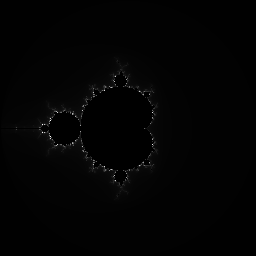

Fixed image
===========

It is time to bring everything together and generate a complete
Mandelbrot image with fixed parameters.

Modify the main loop in `run` to call `calcPixel` to get the RGB
value for each pixel instead of generating the color based on the
row and column values. Be sure to pass the correct parameters to
`calcPixel`. The maximum number of iterations should be loaded from
the `iters` field in `params.s`; it should not be hard-coded in
`run.s`.

When you run your code, you should get this exact image:

